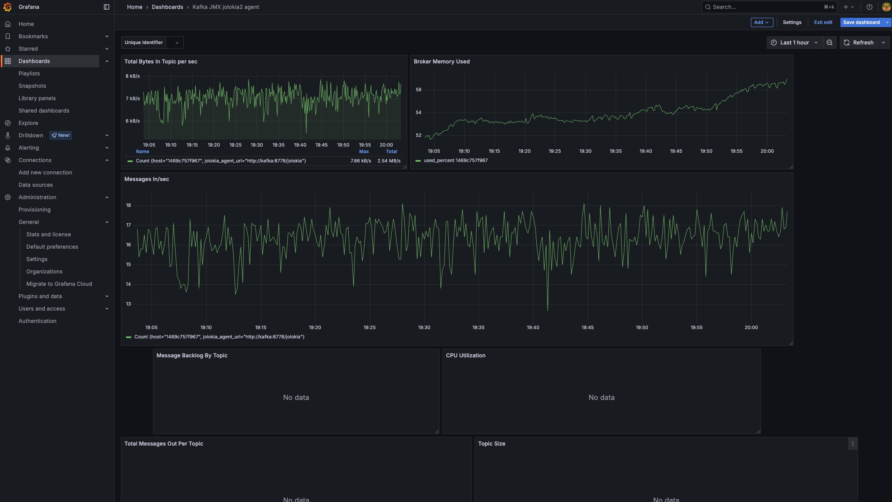

# kafka-monitoring-visualization
A demonstration of using Kafka, InfluxDB and Grafana to visualize live timeseries data on your broker

A blog entry describing how to set this up can be read here: https://www.melvin-jones.com/post/local-kafka-monitoring-with-docker-jolokia-telegraf-influxdb-grafana

